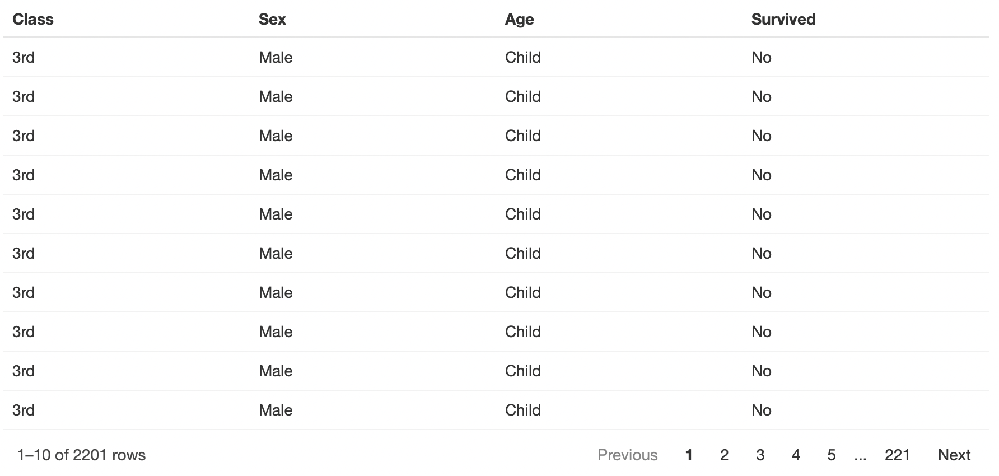
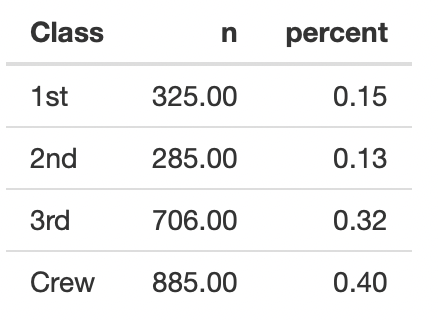

##  Labs BST692: TITANIC Dataset

---

### Lab2

#### Objective:

Import data, create a table, and reactable in Shiny 

#### Step 1

Open the `app.R` file.

#### Step 2

Import the `Titanic` data into your Shiny app.

Save the data into an object called 'the_data'. **Be aware that the `Titanic` dataset is in a weighted format**.  To facilitate analysis, you should convert the dataset to have one record per person.

> `the_data <- ???`

**Hints:**

> `datasets??Titanic` # to load the data into the R environment  
> `as_tibble()`       # to create a tibble  
> `uncount(??)`       # to unnest/ungroup/unweight or expand the dataset  

#### Step 3

#### <mark>Go to the server:</mark>

In your server, create a `reactable` object to display the dataset. 

It should look like this:

**Hints:**

> output$??? <-  
> renderReactable()  
> reactable()  

#### Step 4

In your server, create a table object to display the count of passengers for each class and crew.

It should look like this:

**Hints:**  

> output$???  <-  
> renderTable({})  
> tabyl(Class)  
> adorn_rounding(2)  

#### Step 5

#### <mark>Go to UI:</mark>

In your UI, create an output object of class `table`. 

Hints:

> tableOutput("???")  
> [Shiny Cheat Sheet](https://shiny.rstudio.com/images/shiny-cheatsheet.pdf)

#### Step 6

In your UI, create an output object of class `reactable`.

Hints:

> reactableOutput("???")

#### Step 7

Save the app.R file.

#### Step 8

Click the `Run app` button to deploy your Shiny app.
